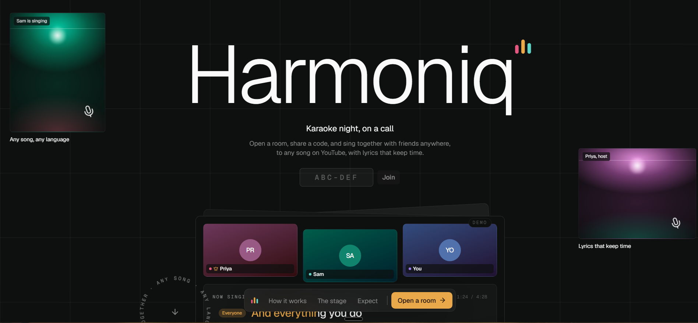

<div align="center">



<br />

# Harmoniq

**Karaoke night, on a call.** Open a room, share a six letter code, and sing any song on YouTube
together with friends anywhere, with lyrics that keep time.

<br />


</div>

---

## What it is

Three friends in three cities want to sing Yellow together. One opens a room and sends a code. The
others join in their browser, pick a colour, and press one button. From then on there is a single
shared timeline: when the host presses play, everyone's instrumental and everyone's lyrics move in
step, inside about a quarter of a second of each other.

The lyrics are ours, not the video's. The words fill with stage amber as they are sung, and in a
duet each singer's lines light up in their own colour so nobody talks over the chorus.

## What it does

| | |
|---|---|
| **Rooms** | Open one in a click, share a code or a link. Camera and mic preflight before you join |
| **Any song, any language** | Search YouTube for a karaoke version, or paste a link. Hindi, Spanish, Korean, whatever the night wants |
| **Lyrics that keep time** | Synced lyrics from LRCLIB, swept in time with the track. The intro counts down, and the host can align the words to what is actually being sung |
| **Duets in colour** | Everyone picks a gel when they join. Hand lines to singers, or alternate them in one tap |
| **One timeline** | The host's player is the clock. Everyone else is corrected quietly, without a jump you would hear |
| **The call** | Video and voice over LiveKit, with a speaking ring in each singer's colour, reactions and chat |
| **Host handoff** | If the host drops off, the next person in the room takes over |

## Quick start

```bash
npm install
cp .env.example .env.local     # fill in the values, see Setup below
npm run dev
```

Open <http://localhost:3000>.

## Setup

Three services, all with free tiers. Fifteen minutes the first time.

<details>
<summary><b>Firebase</b> gives you accounts and the shared room state</summary>

<br />

1. Create a project at [console.firebase.google.com](https://console.firebase.google.com) (the
   free Spark plan is enough).
2. **Build > Authentication > Sign-in method**: enable **Email/Password** and **Google**.
3. **Build > Firestore Database**: create it in production mode.
4. **Project settings > General > Your apps**: add a web app and copy its config into the
   `NEXT_PUBLIC_FIREBASE_*` variables.
5. **Project settings > Service accounts**: generate a private key, then base64 it into
   `FIREBASE_SERVICE_ACCOUNT_BASE64`:

   ```powershell
   # Windows PowerShell
   [Convert]::ToBase64String([IO.File]::ReadAllBytes("service-account.json"))
   ```

   ```bash
   # macOS or Linux
   base64 -w0 service-account.json
   ```

6. Publish the rules in this repository:

   ```bash
   npx -y firebase-tools deploy --only firestore:rules,firestore:indexes --project <project-id>
   ```

</details>

<details>
<summary><b>LiveKit</b> carries the video and voice</summary>

<br />

1. Create a project at [cloud.livekit.io](https://cloud.livekit.io) (the free Build tier covers
   5,000 participant minutes a month).
2. **Settings > Keys**: create an API key.
3. Copy the websocket URL into both `LIVEKIT_URL` and `NEXT_PUBLIC_LIVEKIT_URL`, and the key and
   secret into `LIVEKIT_API_KEY` and `LIVEKIT_API_SECRET`.

</details>

<details>
<summary><b>YouTube</b> is optional, and only changes how search is served</summary>

<br />

Without a key, search uses `youtubei.js` and has no quota. With a key, it uses the official Data
API v3 (about 100 searches a day on the free quota) and falls back automatically when that runs
out.

Create a key in the Google Cloud console with the **YouTube Data API v3** enabled and put it in
`YOUTUBE_API_KEY`. Do not add an HTTP referrer restriction: search runs on the server.

</details>

## Scripts

| Script | What it does |
|---|---|
| `npm run dev` | Dev server, Turbopack |
| `npm run build` | Production build |
| `npm run typecheck` | Route types, then `tsc` |
| `npm run lint` | ESLint |
| `npm test` | Unit tests, Vitest |
| `npm run test:e2e` | End to end, Playwright, against real Firebase and LiveKit |
| `npm run test:rules` | Firestore security rules against the emulator |
| `npm run format` | Prettier |

The end to end suite signs in as three fixed accounts (`e2e-host`, `e2e-friend`, `e2e-solo` at
`harmoniq.test`) and creates real rooms, so point it at a development Firebase project.

## How it works

```
Browser                                  Server (route handlers, server actions)
  Firebase Auth  ─────────────────────>  session cookie, verified with firebase-admin
  Firestore onSnapshot                   rooms, members, queue, playback, chat
  LiveKit room  ──── WebRTC ─────────>   token minted per member
       └── data channel: position ticks, clock pings, reactions
  YouTube IFrame player (visible)  <───  search adapter: Data API, or youtubei.js
  Lyric engine  <─────────────────────   LRCLIB, cached in Firestore
```

The split that matters: anything that must survive a refresh or reach a late joiner is a Firestore
document. Anything high frequency, such as the host's position ticks twice a second, rides the
LiveKit data channel and is never written down. Followers reconcile against the host's clock and
correct drift by nudging playback rate rather than seeking, so a correction is inaudible.

## Worth knowing

- **Wear headphones.** Speakers leak the instrumental into your microphone and everyone hears an
  echo.
- **Voices arrive a beat late.** Internet calls carry roughly a tenth to a third of a second of
  delay. The track stays in sync; your friends' voices trail it slightly.
- **The YouTube player stays visible.** YouTube's terms forbid hidden or background playback, so
  the instrumental plays in a small tile beside the lyrics rather than out of sight. Videos whose
  owners block embedding are filtered out of search.
- **Lyrics depend on LRCLIB coverage.** When a song has none, the panel says so and the karaoke
  video's own words are the fallback.

## Docs

- **[DEPLOY.md](./DEPLOY.md)** takes it live on Vercel, step by step.
- **[PRODUCT.md](./PRODUCT.md)** is the product truth the design decisions answer to.
- **[DESIGN.md](./DESIGN.md)** is the design system, recorded from the built interface.
- **[docs/plans](./docs/plans)** holds the implementation plan and the amendments made while
  building.

<div align="center">
<br />
<sub>Built with Next.js, Firebase, LiveKit, the YouTube IFrame player, and LRCLIB lyrics.</sub>
</div>
